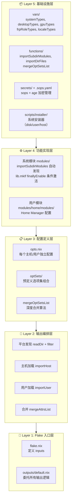
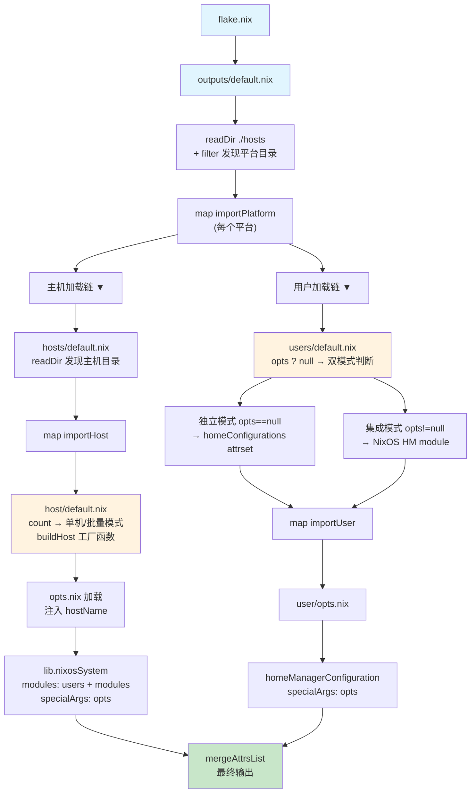

# 🏗️ 架构概览

[⬅️ 返回主文档](../README.md)

---

## 目录

- [1. 整体架构](#1-整体架构)
- [2. 核心维度一：细粒度（Fine-Grained Control）](#2-核心维度一细粒度fine-grained-control)
- [3. 核心维度二：高隔离（High Isolation）](#3-核心维度二高隔离high-isolation)
- [4. 核心维度三：松耦合（Loose Coupling）](#4-核心维度三松耦合loose-coupling)
- [5. 核心维度四：多模式（Multi-Mode）](#5-核心维度四多模式multi-mode)
- [6. 补充维度五：显式声明（Explicit Declaration）](#6-补充维度五显式声明explicit-declaration)
- [7. 补充维度六：约定优于配置（Convention over Configuration）](#7-补充维度六约定优于配置convention-over-configuration)
- [8. 补充维度七：声明式不可变基础设施（Declarative Immutable Infrastructure）](#8-补充维度七声明式不可变基础设施declarative-immutable-infrastructure)
- [9. 补充维度八：关注点分离（Separation of Concerns）](#9-补充维度八关注点分离separation-of-concerns)
- [10. 补充维度九：最小知识原则（Least Knowledge / Law of Demeter）](#10-补充维度九最小知识原则least-knowledge--law-of-demeter)
- [11. 设计决策总结表](#11-设计决策总结表)

---

## 1. 整体架构

### 五层架构图



### 数据流说明



---

## 2. 核心维度一：细粒度（Fine-Grained Control）

### 三层粒度控制体系

本框架提供三层递进式的粒度控制，从单个软件行为到大规模部署，满足不同场景的精确控制需求。

| 层级           | 控制范围         | 实现方式                                     | 典型场景                         |
| -------------- | ---------------- | -------------------------------------------- | -------------------------------- |
| **opts 层**    | 单个软件行为     | `opts.<category>.<module>.enable` + 细化参数 | 精确开关某个工具，调整其配置参数 |
| **optSets 层** | 组合式抽象       | 预定义选项集 + `mergeOptSetsList` 深度合并   | 减少样板代码，复用常见配置组合   |
| **批量输出层** | 大规模同质化实例 | `count` 变量 + `buildHost` 工厂函数          | 企业100台同配置主机的快速生成    |

#### 层级详解

##### 第一层：opts 层 —— 单个软件行为的精确控制

每个主机或用户都拥有独立的 `opts.nix` 文件，采用层级化的属性结构组织配置项。这种设计使得每个软件的行为都可以被独立控制，不会产生隐式的全局状态污染。

```nix
# 示例：精确控制 SSH 服务和 Nix CLI 助手
{
  service = {
    openssh.enable = true;   # 启用 SSH 服务
    nginx.enable = false;    # 禁用 Nginx
  };
  cli = {
    nh.enable = true;        # 启用 nh 工具
    bat.enable = false;      # 禁用 bat
    git.enable = true;       # 启用 git
  };
}
```

##### 第二层：optSets 层 —— 组合式抽象

当多个主机共享相似的配置时，可以将公共配置提取为"选项集"（Option Set），然后通过深度合并算法将多个选项集组合在一起。这避免了重复配置，同时保持了灵活性。

```nix
# optSets/baseEnv.nix - 基础环境选项集
{
  cli = {
    nh.enable = true;
    git.enable = true;
    just.enable = true;
  };
}
```

##### 第三层：批量输出层 —— 大规模实例工厂

对于需要部署大量同构主机的场景（如集群、实验室），通过 `count` 变量控制生成的实例数量，配合 `buildHost` 工厂函数实现自动化批量生成。

### 设计思想

| 思想                                             | 在本框架中的体现                                                                                 |
| ------------------------------------------------ | ------------------------------------------------------------------------------------------------ |
| **分层架构（Layered Architecture）**             | 五层架构清晰分离了入口、编排、配置、实现和基础设施，每层只依赖下层                               |
| **工厂模式（Factory Pattern）**                  | `buildHost` 函数封装了主机创建逻辑，通过参数化实现不同实例的生成                                 |
| **组合优于继承（Composition over Inheritance）** | `optSets` 通过 `mergeOptSetsList` 组合多个选项集，而非建立继承链；新选项集可以自由组合已有选项集 |
| **参数化类型/泛型思想**                          | `buildHost(hostName)` 类似泛型函数，`pkgSets(system)` 根据系统架构参数化生成不同的包集合         |

---

## 3. 核心维度二：高隔离（High Isolation）

### 三层面隔离机制

高隔离确保系统的各个部分相互独立，故障不会横向传播，修改的影响范围可控。

| 隔离层面       | 隔离机制               | 实现方式                                                     | 隔离效果                             |
| -------------- | ---------------------- | ------------------------------------------------------------ | ------------------------------------ |
| **主机间隔离** | 独立目录结构           | 每个主机拥有独立的目录、opts.nix、hardware-configuration.nix | 一台主机的配置错误不影响其他主机     |
| **用户间隔离** | 独立 Home Manager 配置 | 每个用户拥有独立的 Home Manager 实例和 opts.nix              | 一个用户的桌面环境配置不影响其他用户 |
| **模块间隔离** | 条件激活 + opts 通信   | `lib.mkIf finallyEnable` 条件激活，模块间无直接依赖          | 禁用的模块完全不参与构建，零开销     |

### 设计思想

| 思想                                      | 在本框架中的体现                                                                   |
| ----------------------------------------- | ---------------------------------------------------------------------------------- |
| **沙盒/容器化思想（Sandboxing）**         | 每个主机、用户、模块都在自己的"沙箱"中运行，边界清晰                               |
| **故障隔离（Failure Isolation）**         | 一个模块的配置错误不会导致整个系统构建失败（禁用的模块不参与评估）                 |
| **信息隐藏（Information Hiding）**        | 模块内部实现对外部不可见，只能通过 `opts` 接口交互                                 |
| **接口隔离原则（Interface Segregation）** | 每个 module 只暴露最小必要的接口（即其对应的 opts 子集），不应强迫依赖不需要的接口 |

---

## 4. 核心维度三：松耦合（Loose Coupling）

### 八层自动发现机制

松耦合的核心实现是**约定优于配置**的自动发现机制。系统在8个不同的层级实现了自动扫描和加载，使得新增组件几乎无需修改现有代码。

| 层级               | 发现机制                         | 新增操作                          | 删除操作 | 发现位置                                                       |
| ------------------ | -------------------------------- | --------------------------------- | -------- | -------------------------------------------------------------- |
| **平台 Platform**  | `readDir ./hosts` + filter       | 创建目录 + default.nix            | 删除目录 | [outputs/default.nix](../outputs/default.nix)                  |
| **主机 Host**      | `readDir ./.` + filter           | 创建目录 + default.nix + opts.nix | 删除目录 | [hosts/default.nix](../outputs/hosts/x86_64-linux/default.nix) |
| **用户 User**      | `readDir ./.` + filter(排除root) | 创建目录 + default.nix + opts.nix | 删除目录 | [users/default.nix](../outputs/users/default.nix)              |
| **nixos 模块等**   | `importSubdirModules` 递归扫描   | 创建 .nix 文件                    | 删除文件 | [modules/nixos/default.nix](../modules/nixos/default.nix)      |
| **选项集 OptSet**  | `importDirFiles` 扫描 .nix 文件  | 创建 .nix 文件                    | 删除文件 | [optSets/default.nix](../outputs/optSets/default.nix)          |
| **变量 Vars**      | `importDirFiles` 扫描 .nix 文件  | 创建 .nix 文件                    | 删除文件 | [vars/default.nix](../vars/default.nix)                        |
| **函数 Functions** | `importDirFiles` 扫描 .nix 文件  | 创建 .nix 文件                    | 删除文件 | [functions/default.nix](../functions/default.nix)              |

### 设计思想

| 思想                                              | 在本框架中的体现                                                             |
| ------------------------------------------------- | ---------------------------------------------------------------------------- |
| **约定优于配置（Convention over Configuration）** | 遵循命名约定（`.nix` 文件、`default.nix`、目录结构）即可被自动发现，无需注册 |
| **开闭原则（Open/Closed Principle）**             | 对扩展开放（添加文件即生效），对修改关闭（无需改动现有代码）                 |
| **插件架构（Plugin Architecture）**               | 每个模块都是"插件"，放入目录即被加载，移除即卸载                             |
| **依赖倒置（Dependency Inversion）**              | 高层模块（主机配置）依赖抽象（opts 接口），不依赖具体模块实现                |
| **观察者/发布订阅简化版**                         | 模块"订阅"opts 中的特定路径，当 opts 变化时自动响应（通过 Nix 的惰性求值）   |

---

## 5. 核心维度四：多模式（Multi-Mode）

### 六种运行模式

本框架支持六种不同的运行模式，以适应从个人开发到企业部署的各种场景。

| 模式                | 触发条件                      | 适用场景                               | 关键代码位置                                                                 |
| ------------------- | ----------------------------- | -------------------------------------- | ---------------------------------------------------------------------------- |
| **单机模式**        | `count <= 1`（默认）          | 个人开发机、服务器                     | [host default.nix](../outputs/hosts/x86_64-linux/default-x86-64/default.nix) |
| **批量模式**        | `count > 1`                   | 企业同质化部署、集群                   | [host default.nix](../outputs/hosts/x86_64-linux/default-x86-64/default.nix) |
| **用户独立模式**    | `opts == null`                | `nh home switch` 直接使用 Home Manager | [users/default.nix](../outputs/users/default.nix)                            |
| **用户集成模式**    | `opts != null`                | 作为 NixOS 模块被主机导入              | [users/default.nix](../outputs/users/default.nix)                            |
| **多平台模式**      | `vars/systemTypes` 定义多架构 | 交叉编译、异构集群                     | [outputs/default.nix](../outputs/default.nix)                                |
| **多 nixpkgs 实例** | `pkgSets` 定义 3 套 pkgs      | 稳定性需求、版本锁定                   | [outputs/default.nix](../outputs/default.nix)                                |

#### 模式详解

##### 模式 1 & 2：单机模式 vs 批量模式

这两种模式由同一个配置文件根据 `count` 变量的值动态切换：

```nix
# 单机模式 (count = 1)
hostNames = ["default-x86-64"]
# 生成: nixosConfigurations.default-x86-64 = { ... }

# 批量模式 (count = 100)
hostNames = ["default-x86-64-1", "default-x86-64-2", ..., "default-x86-64-100"]
# 生成: nixosConfigurations.default-x86-64-1 = { ... }
#        nixosConfigations.default-x86-64-2 = { ... }
#        ...
```

##### 模式 3 & 4：用户独立模式 vs 集成模式

用户子系统支持两种完全不同的运行方式：

- **独立模式**：用户配置作为独立的 Flake 输出，可以通过 `nh home switch .#username-platform` 直接使用
- **集成模式**：用户配置作为 NixOS module 被主机配置导入，Home Manager 由系统管理

```nix
# 独立模式的调用链
outputs/default.nix → users/default.nix(opts=null) → homeConfigurations

# 集成模式的调用链
host/default.nix → users(default.nix作为module导入) → home-manager NixOS module
```

##### 模式 5：多平台模式

框架原生支持多种 CPU 架构：

```nix
# vars/systemTypes.nix
{
  i686-linux = "i686-linux";
  x86_64-linux = "x86_64-linux";
  x86_64-darwin = "x86_64-darwin";
  aarch64-linux = "aarch64-linux";
  aarch64-darwin = "aarch64-darwin";
}
```

只需在 `outputs/hosts/` 下创建对应架构的目录，即可支持新平台。

##### 模式 6：多 nixpkgs 实例

为了平衡稳定性和最新特性，框架同时维护三个 nixpkgs 实例：

```nix
pkgSets = system: {
  pkgs = import nixpkgs { inherit system; };           # master（最新）
  pkgs-unstable = import nixpkgs-unstable { ... };     # nixos-unstable
  pkgs-2511 = import nixpkgs-2511 { ... };             # nixos-25.11（稳定版）
};
```

模块可以根据需要选择使用哪个 pkgs 实例：

- 系统关键组件使用 `pkgs-2511`（稳定）
- 开发工具使用 `pkgs-unstable` 或 `pkgs`（最新特性）

### 设计思想

| 思想                                         | 在本框架中的体现                                                                  |
| -------------------------------------------- | --------------------------------------------------------------------------------- |
| **策略模式（Strategy Pattern）**             | 单机/批量模式、独立/集成模式都是策略的不同实现，通过条件选择                      |
| **适配器模式（Adapter Pattern）**            | `users/default.nix` 既是独立的 attrset 产出者，又是 NixOS module 适配器           |
| **多态（Polymorphism）**                     | 同一个用户配置可以在两种不同的上下文中运行，表现出不同的行为                      |
| **上下文参数化（Context Parameterization）** | 通过 `opts`、`system`、`pkgSets` 等参数将上下文信息注入，使同一套代码适应不同环境 |

---

## 6. 补充维度五：显式声明（Explicit Declaration）

> _"Explicit is better than implicit."_ — The Zen of Python

### 核心理念

本框架遵循**显式优于隐式**的原则，要求所有可配置的行为都必须在 `opts.nix` 中明确声明。

### 设计要点

#### 1. 集中式配置管理

每个主机/用户的所有配置集中在一个 `opts.nix` 文件中：

```nix
# 所有行为一目了然
{
  cli.nh.enable = true;        # 我明确启用了 nh
  cli.bat.enable = false;      # 我明确禁用了 bat
  service.openssh.enable = true;  # 我明确启用了 SSH
}
```

没有隐藏的全局配置文件，没有魔法默认值，没有隐式的环境变量依赖。

#### 2. 无隐式全局状态

传统 NixOS 配置中常见的隐式问题在本框架中被消除：

| 隐式问题                                  | 本框架的解决方案                       |
| ----------------------------------------- | -------------------------------------- |
| 全局 `configuration.nix` 修改影响所有主机 | 每个主机独立 opts.nix                  |
| module 间的隐式依赖                       | 只能通过 opts 通信                     |
| 环境变量影响构建结果                      | 所有可能变化的因素都参数化             |
| "魔法"配置路径                            | 统一的 `opts.<category>.<module>` 规范 |

#### 3. 单一数据源原则（Single Source of Truth）

每个配置项只有一个权威来源：

- 主机配置的唯一真相源：`outputs/hosts/<platform>/<host>/opts.nix`
- 用户配置的唯一真相源：`outputs/users/<user>/opts.nix`
- 可复用配置的组合源：`outputs/optSets/*.nix`

### 价值

- **可审计性**：查看一个 opts.nix 即可了解该主机的全部配置意图
- **可重现性**：相同的 opts 总是产生相同的结果
- **可调试性**：配置问题时可以直接定位到具体的 opts 字段
- **团队协作**：Code Review 时只需关注 opts.nix 的变更

---

## 7. 补充维度六：约定优于配置（Convention over Configuration）

> _"Convention over Configuration is not about having no configuration. It's about having sensible defaults and letting you override them when needed."_ — DHH (Rails 创始人)

### 核心理念

本框架大量借鉴了 Ruby on Rails 的 CoC 哲学，通过**强约定**减少必要的配置量。

### 约定体系

#### 1. 目录名 = 身份标识

```bash
outputs/hosts/x86_64-linux/alc/
                            ↑
                        这就是主机名

outputs/users/admin/
                ↑
            这就是用户名

modules/nixos/service/openssh.nix
                ↑        ↑
                分类    模块名
```

无需在任何地方"注册"这些名称——目录名本身就是身份。

#### 2. 放入即生效

新增一个模块的完整流程：

```bash
# 1. 创建文件
touch modules/nixos/service/my-new-service.nix

# 2. 完成！无需其他操作
```

无需：

- 在任何列表中添加引用
- 修改任何 import 语句
- 更新任何注册表
- 重启任何服务

#### 3. 自描述系统

目录结构本身即是文档：

```bash
看到这个结构，你就知道：
- 有 n 个架构平台
- x86_64 下有 n 台主机
- 有 n 个用户
- 服务模块包括 openssh, nginx, greetd...
```

### 发现协议

框架实现了一套完整的**发现协议（Discovery Protocol）**：

| 协议规则                                          | 适用范围           |
| ------------------------------------------------- | ------------------ |
| 目录 + `default.nix` = 有效实体                   | 平台、主机、用户   |
| 子目录中的 `.nix` 文件 = 模块                     | 系统模块、用户模块 |
| 目录中的 `.nix` 文件（排除 default）= 选项集/变量 | optSets、vars      |
| 文件名（去 .nix 后缀）= 键名                      | optSets、vars      |

### 价值

- **降低认知负荷**：学习一次约定，处处适用
- **提高开发效率**：新增功能的操作步骤最少化
- **一致性保证**：约定强制统一的结构和命名
- **新人友好**：阅读目录结构即可理解项目组织

---

## 8. 补充维度七：声明式不可变基础设施（Declarative Immutable Infrastructure）

### 核心理念

本框架是**声明式**和**不可变性**原则的彻底实践者。

### 声明式（Declarative）

#### 描述期望状态，而非执行步骤

```nix
# 声明式：我想要什么
{
  service.openssh.enable = true;   # 我想要 SSH 服务启用
  cli.nh.enable = true;            # 我想要 nh 工具可用
}

# 对比命令式：如何做到
# sudo systemctl enable sshd
# sudo nix-env -iA nixos.nh
# （还需要处理依赖、冲突、顺序...）
```

#### Nix 的声明式优势

- **确定性**：给定相同的输入，总是产生相同的输出
- **幂等性**：应用配置 1000 次与应用 1 次的效果相同
- **可回滚**：每次配置变更都生成新的 generation，可随时回退

### 不可变（Immutable）

#### 基础设施即代码，代码即不可变

```bash
传统模式：
  /etc/ssh/sshd_config  ← 可被手动修改 ← 状态漂移

Nix 模式：
  /nix/store/abc123...-sshd-config  ← 不可修改 ← 内容寻址
  /etc/ssh/sshd.config → symlink → /nix/store/abc123...
```

**不可变性保障**：

- `/nix/store` 中的所有内容都是只读的
- 配置文件是指向 store 的符号链接
- 修改配置 = 生成新的 store 路径 = 切换 symlink

### 函数式编程思想

本框架深刻体现了函数式编程（FP）范式：

| FP 概念  | Nix 表达            | 本框架体现                               |
| -------- | ------------------- | ---------------------------------------- |
| 纯函数   | 相同输入 → 相同输出 | opts → configuration（确定性构建）       |
| 不可变性 | 值一旦创建不可修改  | store 路径不可变，新配置 = 新路径        |
| 引用透明 | 表达式可替换为其值  | Nix 的惰性求值和缓存                     |
| 一等函数 | 函数可作为值传递    | `buildHost`、`importPlatform` 等高阶函数 |
| 组合性   | 小函数组合成大功能  | `mergeOptSetsList` 组合多个选项集        |

### 价值

- **版本控制**：所有配置在 Git 中管理
- **代码审查**：配置变更是 PR，可 review
- **测试**：可通过 `nix flake check` 验证
- **文档**：配置自解释（opts.nix 即文档）
- **自动化**：CI/CD 可自动部署

---

## 9. 补充维度八：关注点分离（Separation of Concerns）

### 核心理念

框架严格遵循 SoC 原则，将不同职责分配到不同的层次和模块中。

### 三层分离

#### 分离 1：nixos 模块 vs home 模块

```bash
modules/
├── nixos/
│   ├── service/openssh.nix     # 系统级：SSH 服务（需要 root）
│   └── hardware/networking.nix # 系统级：网络配置（需要 root）
└── home/
    ├── cli/bat.nix             # 用户级：bat 配置（用户空间）
    └── editor/nixvim.nix       # 用户级：Neovim 配置（用户空间）
```

- **nixos 模块**：运行在系统级别，影响所有用户，需要 root 权限
- **home 模块**：运行在用户级别，只影响当前用户，无需 root

#### 分离 2：选项定义 vs 选项消费

```bash
outputs/hosts/x86_64-linux/alc/opts.nix # 定义：我要什么
modules/nixos/service/openssh.nix       # 消费：如何实现
```

- **定义端**（opts.nix）：声明式地描述期望状态
- **消费端**（module）：读取 opts 并实施配置

这种分离使得：

- 选项定义可以独立于实现进行审查
- 实现可以独立于具体配置进行复用
- 测试可以 mock opts 来验证模块行为

#### 分离 3：输出组装 vs 功能实现

```bash
outputs/default.nix              # 组装：如何将各部分组合在一起
outputs/hosts/.../default.nix    # 组装：主机级别的组装
modules/                          # 实现：具体的功能代码
functions/                        # 实现：工具函数
vars/                             # 实现：变量定义
```

- **输出层**：负责发现、加载、合并，不包含业务逻辑
- **实现层**：包含具体的配置逻辑，不知道自己如何被组装

### MVC 变体类比

可以将本框架类比为 MVC 模式的变体：

| MVC 组件   | 本框架对应                           | 职责                     |
| ---------- | ------------------------------------ | ------------------------ |
| Model      | `opts.nix`                           | 数据模型，定义配置的状态 |
| View       | 生成的 NixOS 配置                    | 最终呈现的系统状态       |
| Controller | `outputs/default.nix` + `functions/` | 编排和协调               |

### 价值

- **模块独立性**：修改系统模块不影响用户模块，反之亦然
- **并行开发**：团队成员可以独立工作在不同的分离层次上
- **测试友好**：可以对每一层单独进行测试
- **可替换性**：可以替换实现而不影响接口（opts）

---

## 10. 补充维度九：最小知识原则（Least Knowledge / Law of Demeter）

### 核心理念

> _"Talk only to your immediate friends."_ — Law of Demeter

本框架严格遵循迪米特法则（Law of Demeter），限制模块之间的知识范围和交互方式。

### 法则在本框架中的体现

#### 1. 模块只通过 opts 获取数据

```nix
# ✅ 正确：模块只知道 opts
{ lib, opts, ... }:
let
  cfg = opts.service.openssh or { };
in
{ config = lib.mkIf cfg.enable { ... }; }

# ❌ 错误：模块尝试直接访问其他模块
{ lib, config, ... }:
let
  # 尝试读取 networking 模块的配置！违反 LoD
  networkCfg = config.services.networking or { };
in
{ ... }
```

#### 2. 模块不知道其他模块的存在

```bash
openssh.nix 不知道:
  - networking.nix 是否启用
  - firewall.nix 开放了哪些端口
  - users/admin 是否存在

它只知道:
  - opts.service.openssh.enable 是否为 true
  - opts.service.openssh 的其他配置参数
```

#### 3. opts.nix 是唯一的通讯录

```txt
模块间的“通话”必须经过 opts:

openssh.nix ──► opts.service.openssh ◄── alc/opts.nix
                                               │
networking.nix ◄── opts.hardware.networking ◄──┘
```

没有模块间的"私下交流"，所有数据流都经过 opts 这个"总机"。

### 轻量级中介者模式

opts.nix 扮演了**中介者（Mediator）**的角色，但比经典的 GoF 中介者模式更轻量：

| 经典中介者                       | 本框架的 opts           |
| -------------------------------- | ----------------------- |
| 显式的 Mediator 对象             | 隐式的 attrset 数据结构 |
| Colleague → Mediator → Colleague | Module → opts → Module  |
| Mediator 包含业务逻辑            | opts 是纯数据，无逻辑   |
| 需要注册/注销机制                | 自动发现，无需注册      |

### 价值

- **低耦合**：模块间的依赖关系被降到最低
- **高内聚**：每个模块只关心自己的配置领域
- **易维护**：修改一个模块不影响其他模块
- **易测试**：可以独立测试每个模块（mock opts 即可）
- **易理解**：模块的依赖关系一目了然（只依赖 opts）

---

## 11. 设计决策总结表

以下是框架的关键设计决策及其理由：

| 决策项           | 选择                              | 替代方案                    | 理由                                                                                                            |
| ---------------- | --------------------------------- | --------------------------- | --------------------------------------------------------------------------------------------------------------- |
| **组件发现机制** | 自动发现（readDir + filter）      | 显式注册（维护列表）        | 符合开闭原则，新增组件无需修改现有代码，降低遗漏风险                                                            |
| **配置组织方式** | opts.nix 集中配置                 | 分散到各模块文件            | 单一数据源，配置意图一目了然，便于 Code Review 和审计                                                           |
| **选项复用机制** | optSets 组合式（深度合并）        | 继承式（extends/base）      | 组合更灵活，支持任意数量的选项集混合，避免钻石继承问题                                                          |
| **模块分层**     | 双层模块（系统/用户）             | 单层混合                    | 关注点分离，系统配置与用户配置生命周期不同，权限边界清晰                                                        |
| **用户子系统**   | 双模式单文件（isStandAlone 判断） | 分离为两个独立文件          | 避免 DRY 违反，两种模式共享发现逻辑，减少同步维护成本                                                           |
| **函数库管理**   | 手动注册（default.nix）           | 自动发现                    | 函数有语义和依赖关系，需要显式导出，避免命名冲突                                                                |
| **选项集合并**   | mergeOptSetsList 深度合并         | 浅覆盖（// 操作符）         | 列表字段需要拼接而非覆盖（如 extraGroups、substituters），嵌套配置需要递归处理                                  |
| **批量生成控制** | count 内部变量                    | 外部函数参数                | count 是主机模板的内部属性，不属于外部接口，封装性更好                                                          |
| **模块激活机制** | lib.mkIf finallyEnable            | 始终加载 + 条件配置         | 未启用的模块完全不计入构建图，提升评估性能，避免副作用                                                          |
| **多包实例**     | pkgSets 定义 3 套 pkgs            | 单一 nixpkgs + overlays     | 版本隔离更彻底，避免 unstable 包破坏 stable 系统，支持按需选择稳定性等级                                        |
| **平台映射**     | vars/systemTypes 显式映射         | 目录名直接作为系统标识      | 支持别名（如 `x86_64` → `x86_64-linux`），灵活的命名策略                                                        |
| **密钥管理**     | sops + age 加密（.sops.yaml）     | Git 子模块、git-crypt、nage | age 密钥现代且安全，sops 与 NixOS 深度集成（sops-nix），支持密钥轮换和细粒度访问控制；.sops.yaml 声明式加密规则 |

### 决策哲学

这些设计决策共同体现了以下哲学：

1. **简单性优先**：在满足需求的前提下，选择最简单的方案（如手动注册函数库）
2. **渐进复杂度**：只在必要时引入复杂性（如深度合并算法）
3. **一致性**：相似的决策采用相似的模式（如各层的自动发现）
4. **可演进性**：当前的选择不妨碍未来的改进（如 secrets 可从子模块迁移到 sops）

---

<div align="center">

---

_架构设计的终极目标是让复杂变得简单，让变化变得可控。_

</div>
